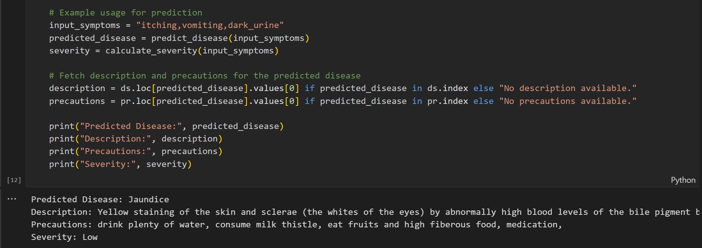

# 🩺 Disease Prediction System

  


Predict **diseases based on symptoms** using **machine learning and dataset-driven analysis**.  
This project leverages multiple symptom datasets to recommend **likely conditions and preventive measures**.

---

## 📂 Setup Instructions
Clone the repository and set up a virtual environment:

```bash
git clone https://github.com/your-username/disease-prediction.git
cd disease-prediction
python -m venv .venv
source .venv/bin/activate   # Windows: .venv\Scripts\activate
pip install -r requirements.txt
```

If no `requirements.txt` is provided, install manually:

```bash
pip install numpy pandas scikit-learn matplotlib seaborn jupyter
```

---

## 🔄 How to Use
1. Open the notebook in **Jupyter**:
   ```bash
   jupyter notebook embrizon_project_2_with_dataset.ipynb
   ```
2. Update the dataset paths if required.  
3. Modify the input symptoms using the **reference_dataset.csv**.  
4. Run all cells **top to bottom** to generate predictions.

---

## 📊 Datasets
This project uses **five datasets**:
- `dataset.csv`  
- `symptom_description.csv`  
- `symptom_precaution.csv`  
- `symptom_severity.csv`  
- `reference_dataset.csv` (derived from `dataset.csv` to structure inputs)

---

## 📈 Key Results
- ✅ Accepts **multiple symptom inputs** for prediction  
- 🔄 **Higher accuracy** when more than 2 symptoms are provided  
- 🧾 Provides **possible diseases** with severity scores  
- 💡 Suggests **precautions** based on the predicted condition  

Example output:  
  

---

## 🛠️ Tech Stack
- **Python** 🐍  
- **NumPy / Pandas** → Data handling  
- **Matplotlib / Seaborn** → Visualization  
- **scikit-learn** → Prediction modeling  
- **Jupyter Notebook** → Interactive analysis  

---

## 🤝 Contributing
Pull requests are welcome!  
- Fork the repo  
- Create a feature branch (`git checkout -b feature-name`)  
- Commit changes and open a Pull Request  

---

## 📜 License
This project is licensed under the **MIT License**.  

---

📌 **Author:** *Shivam Amitbhai Patel*
